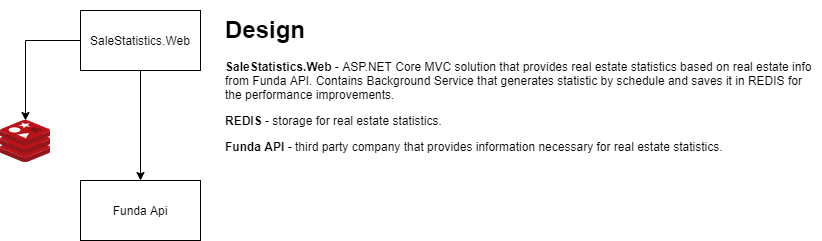

# Funda Assessment
Funda Assessment is an implementation of .NET Software Engineer Technical Assignment task. [pdf](docs/assessment.pdf)

## High level design 

## Prerequisites
* docker 
* docker-compose
* .NET Core SDK 3.1
* PowerShell

## How to run application without Visual Studio
Just run **_start.bat** script

# Tech Stack
 * [ASP.NET Core](https://docs.microsoft.com/en-us/aspnet/core/?view=aspnetcore-3.1)
 * [Refit](https://github.com/reactiveui/refit) 
 * [NUnit](https://nunit.org/)
 * [MediatR](https://github.com/jbogard/MediatR)
 * [AutoMapper](https://automapper.org/)

## Principles:
* SOLID
* Clean Arhitecture
* CQRS
* Feature Folders

# License

Funda Assessment is open source software, licensed under the terms of MIT license. 
See [LICENSE](LICENSE) for details.